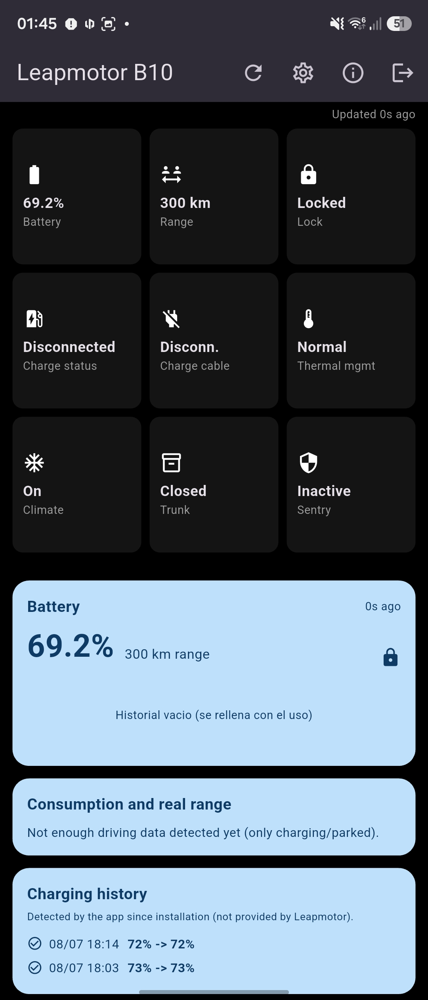
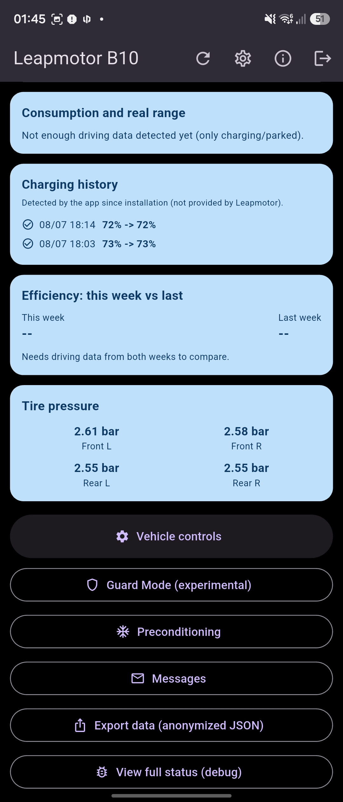
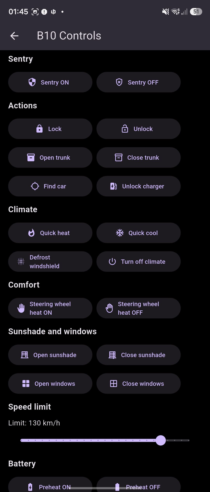
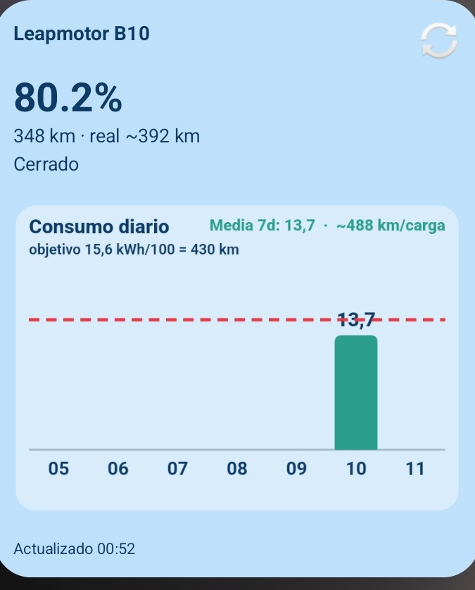

# LMB10 — Unofficial Leapmotor Companion App / App no oficial para Leapmotor

An Android app (Flutter) that talks directly to Leapmotor's international cloud backend — the same protocol used by the official app — to monitor and remotely control your vehicle, with extra features the official app doesn't offer.

Una app Android (Flutter) que se conecta directamente a la nube internacional de Leapmotor — el mismo protocolo que usa la app oficial — para consultar y controlar el vehiculo de forma remota, con funciones extra que la app oficial no ofrece.

DISCLAIMER: Unofficial, independent project. Not affiliated with, endorsed by, or associated with Leapmotor. Uses Leapmotor's cloud API via community-documented reverse engineering (see Credits). Use at your own risk: Leapmotor may change the API at any time. Using a secondary account (not your primary one) is recommended to avoid session conflicts with the official app.

AVISO: Proyecto no oficial e independiente. No esta afiliado a, respaldado por, ni asociado con Leapmotor. Usa la API en la nube de Leapmotor mediante ingenieria inversa documentada por la comunidad (ver seccion Creditos). Usalo bajo tu propia responsabilidad: Leapmotor puede cambiar la API en cualquier momento. Se recomienda una cuenta secundaria (no la principal) para evitar conflictos de sesion con la app oficial.

## Author / Autor

SurferRule

## Support the project / Apoyar el proyecto

If you find this useful, you can buy me a coffee on Ko-fi: https://ko-fi.com/txurtxil
Si te resulta util, puedes invitarme a un cafe en Ko-fi: https://ko-fi.com/txurtxil

## License / Licencia

GNU General Public License v3.0 (GPLv3). See the LICENSE file in this repository for the full text.
Ver el archivo LICENSE en este repositorio para el texto completo.

## Screenshots / Capturas

Dashboard views showing the battery/range/lock tiles, the compact location card, and the charging history and efficiency cards.
Vistas del dashboard con las tiles de bateria/autonomia/cerradura, la tarjeta compacta de ubicacion, y las tarjetas de historial de carga y eficiencia.

Home-screen widget: current SOC, manufacturer range vs. your real-world estimate, lock status, and a daily-consumption bar chart with a target line for the 430 km max-range figure.
Widget de pantalla de inicio: SOC actual, autonomia del fabricante frente a tu estimacion real, estado de cerradura, y un grafico de barras de consumo diario con una linea objetivo para los 430 km de autonomia maxima.

## Which Leapmotor models does this work with? / Con que modelos de Leapmotor funciona

This project was built and tested against a Leapmotor B10, but the protocol layer talks to Leapmotor's shared international backend (appgateway.leapmotor-international.de), not to B10-specific endpoints. The vehicle list, login, signing, and remote-control flow are generic across Leapmotor's line-up; the only per-model detail handled explicitly is the vehicle status path (B10 and B11 share the C10 status endpoint, per the community reference client). Owners of other Leapmotor models (C10, C16, T03, etc.) are welcome to try it and report back — some remote actions may not apply to every model or trim.

Este proyecto se ha construido y probado sobre un Leapmotor B10, pero la capa de protocolo habla con el backend internacional compartido de Leapmotor (appgateway.leapmotor-international.de), no con endpoints exclusivos del B10. El listado de vehiculos, el login, la firma de peticiones y el flujo de comandos remotos son genericos en toda la gama Leapmotor; el unico detalle especifico por modelo que se gestiona explicitamente es la ruta de estado del vehiculo (B10 y B11 comparten el endpoint de estado de C10, segun el cliente de referencia de la comunidad). Si tienes otro modelo Leapmotor (C10, C16, T03, etc.) eres bienvenido a probarlo y contarnos que tal — es posible que algunas acciones remotas no apliquen a todos los modelos o acabados.

## Features / Caracteristicas

### Session & security / Sesion y seguridad
- Real login against Leapmotor's cloud with HMAC-SHA256 request signing and mTLS (static app certificate + a per-account PKCS#12 certificate extracted at login), matching the official app's protocol.
- Persistent session: after the first login, session data is stored encrypted (flutter_secure_storage) and the access token refreshes automatically — no need to log in again unless the session fully expires.
- Optional PIN: can be remembered encrypted on-device, or requested just-in-time before opening vehicle controls.

- Login real contra la nube de Leapmotor con firma HMAC-SHA256 y mTLS (certificado estatico de la app + certificado PKCS#12 de cuenta extraido en el login), igual que el protocolo de la app oficial.
- Sesion persistente: tras el primer login, los datos de sesion se guardan cifrados (flutter_secure_storage) y el token de acceso se refresca solo, sin volver a pedir usuario/contrasena salvo expiracion total.
- PIN opcional: puede recordarse cifrado en el dispositivo, o pedirse justo antes de abrir los controles del vehiculo.

### Dashboard
- Live status with automatic refresh every 90 seconds: battery (precise SOC), range, lock, charge state and cable, battery thermal management, climate, trunk and sentry status.
- "Vehicle controls" button pinned at the top, above the battery card, for one-tap access to all remote actions.
- Compact location card: reverse-geocoded address (cached to respect OpenStreetMap/Nominatim's usage policy), distance from your current position to the car, and a tap-to-expand full-screen interactive map. Can be hidden entirely from Settings for a text-only dashboard.
- Battery card with a bar-chart history (locally recorded, fills in over time).
- Charging history card: detects charging sessions automatically (date, start/end %) — Leapmotor's API doesn't expose this history, so it's inferred locally from repeated status polling.
- Consumption & real range card: calculates % battery used per 100 km from the odometer and compares your real-world range against the manufacturer's estimate.
- Weekly efficiency card: this week's consumption vs. last week's.
- Tire pressure card (in bar), read from the vehicle's status signals.
- Toolbar: an envelope icon with an unread-message badge, and a settings menu grouping Settings, Export history, Import backup, Guard Mode (experimental) and the Debug screen.
- Non-blocking network error handling: transient failures (tunnels, dead zones) keep the last known state visible and retry quietly instead of blanking the screen.
- Debug screen with snapshot/diff: save a full raw status snapshot, run a command, and compare exactly which fields (including unmapped raw signals) actually changed — the tool used to verify which remote commands genuinely do something on the vehicle.

- Estado en vivo con refresco automatico cada 90 segundos: bateria (SOC preciso), autonomia, cerradura, estado y cable de carga, gestion termica de la bateria, clima, maletero y centinela.
- Boton "Controles del vehiculo" fijado arriba, encima de la tarjeta de bateria, para acceder a todas las acciones remotas con un toque.
- Tarjeta de ubicacion compacta: direccion por geocodificacion inversa (cacheada para respetar la politica de uso de OpenStreetMap/Nominatim), distancia desde tu posicion actual hasta el coche, y mapa interactivo a pantalla completa al tocarla. Se puede ocultar del todo desde Ajustes para un dashboard solo de texto.
- Tarjeta de bateria con historial en barras (grabado localmente, se va rellenando con el uso).
- Tarjeta de historial de cargas: detecta sesiones de carga automaticamente (fecha, % inicial/final) — la API de Leapmotor no expone este historico, se infiere localmente comparando lecturas de estado sucesivas.
- Tarjeta de consumo y autonomia real: calcula el % de bateria consumido cada 100 km a partir del odometro y compara tu autonomia real con la estimacion del fabricante.
- Tarjeta de eficiencia semanal: consumo de esta semana frente a la anterior.
- Tarjeta de presion de neumaticos (en bar), leida de las senales de estado del vehiculo.
- Barra de herramientas: un icono de sobre con globo de mensajes sin leer, y un menu de ajustes que agrupa Ajustes, Exportar historico, Importar backup, Modo Vigilancia (experimental) y la pantalla de Debug.
- Manejo de errores de red no bloqueante: los fallos transitorios (tuneles, zonas sin cobertura) mantienen visible el ultimo estado conocido y reintentan en silencio en vez de dejar la pantalla en blanco.
- Pantalla de debug con snapshot/diff: guarda un estado crudo completo, ejecuta un comando, y compara exactamente que campos (incluidas senales sin mapear) cambiaron de verdad — la herramienta usada para verificar que comandos remotos hacen algo real en el vehiculo.

### Remote controls / Controles remotos
Full PIN-verification flow (AES-128-CBC encrypted operatePassword, server-side verification, and result polling), matching the real protocol:
- Lock/unlock, trunk, find vehicle, unlock charging connector.
- Quick climate (heat/cold), windshield defrost, turn off climate.
- Steering wheel and seat heating (0-3 levels), seat ventilation.
- Battery preheating, configurable charge limit, and a full charge schedule editor (time window + weekdays).
- Sunshade and windows.
- Configurable speed limit.
- Sentry mode toggle (see Known Limitations below).

Flujo completo de verificacion de PIN (operatePassword cifrado AES-128-CBC, verificacion en servidor y sondeo de resultado), replicando el protocolo real:
- Bloqueo/desbloqueo, maletero, localizar, desbloqueo del conector de carga.
- Climatizacion rapida (calor/frio), desempanado de parabrisas, apagar clima.
- Calefaccion de volante y de asientos (niveles 0-3), ventilacion de asientos.
- Precalentado de bateria, limite de carga configurable, y editor completo de horario de carga (franja horaria + dias de la semana).
- Persiana y ventanillas.
- Limite de velocidad configurable.
- Interruptor de modo centinela (ver Limitaciones conocidas mas abajo).

### Preconditioning / Precondicionado
- Immediate preconditioning (climate on right now) and scheduled preconditioning (recurring by weekday, or one-time), with heat/cold, target temperature, and optional steering wheel heating.

- Precondicionado inmediato (climatizar ahora mismo) y programado (recurrente por dia de la semana, o de una sola vez), con calor/frio, temperatura objetivo y calefaccion de volante opcional.

### Sentry Mode / Modo Centinela
- One-tap arming that watches the vehicle and raises high-priority notifications on tamper: uncommanded unlock, door/trunk/window opening, unexpected power-up (READY), and GPS movement/tow (Haversine drift from the parked position), with a timestamped, location-tagged event log.
- Arms the car's own on-board sentry (cmd 220) as a best-effort layer, plus optional horn+lights deterrent (cmd 120) and auto re-lock (cmd 110).
- Background watch through WorkManager; remember the PIN at login for background commands. See Known Limitations for the European firmware and TCU-sleep caveats.

- Armado en un toque que vigila el vehiculo y lanza notificaciones criticas ante manipulacion: desbloqueo no solicitado, apertura de puerta/maletero/ventanilla, encendido inesperado (READY) y movimiento/remolcado por GPS (deriva Haversine desde el punto de aparcamiento), con registro de eventos con hora y ubicacion.
- Arma el centinela propio del coche (cmd 220) como capa de mejor esfuerzo, mas disuasion opcional con claxon+luces (cmd 120) y rebloqueo automatico (cmd 110).
- Vigilancia en segundo plano mediante WorkManager; recuerda el PIN en el login para los comandos en fondo. Ver Limitaciones conocidas para el firmware europeo y el sueno del TCU.

### Experimental / Guard Mode / Experimental / Modo Vigilancia
- A guided screen for a community-documented workaround (continuous 360-camera recording with the car locked), automating the steps that do have a real API command (window, lock) and checklisting the ones that don't (ambient lights, mirrors, headlights, screens).
- Experimental buttons for two undocumented commands found in the reference protocol: a possible "camping mode" (cmd 410) and a possible dashcam-recorder toggle (cmd 290) — neither is confirmed to do anything; test them with the debug snapshot/diff tool.

- Pantalla guiada para un metodo alternativo documentado por la comunidad (grabacion continua con camaras 360 y el coche cerrado), automatizando los pasos que si tienen comando real de API (ventanilla, bloqueo) y dejando como checklist los que no (luces ambientales, espejos, faros, pantallas).
- Botones experimentales para dos comandos sin documentar del protocolo de referencia: un posible "modo acampada" (cmd 410) y un posible interruptor de la grabadora dashcam (cmd 290) — ninguno de los dos esta confirmado; pruebalos con la herramienta de snapshot/diff de debug.

### Desktop widget / Widget de escritorio
- A real, freely resizable Android home-screen widget: current SOC, manufacturer range vs. your real-world estimate, lock status, live charging indicator, and a daily-consumption bar chart (kWh/100 km) with a target line at 15.6 kWh/100 km — the pace needed to reach the B10's 430 km max range. Bars are green at or under target and orange above it, charge days are marked with the energy added, and the weekly average is shown as estimated km per charge.
- Adapts to the size you drag it to (compact / medium / full chart). Refreshes when the app is opened and periodically in the background (WorkManager, ~15 min, Android's minimum) — reliability depends on your phone manufacturer's battery management.

- Widget real de pantalla de inicio Android, redimensionable libremente: SOC actual, autonomia del fabricante frente a tu estimacion real, estado de cerradura, indicador de carga en vivo, y un grafico de barras de consumo diario (kWh/100 km) con una linea objetivo a 15,6 kWh/100 km — el ritmo necesario para alcanzar los 430 km de autonomia maxima del B10. Las barras son verdes si estan en o bajo el objetivo y naranjas si lo superan, los dias con carga se marcan con la energia anadida, y la media semanal se muestra como km por carga estimados.
- Se adapta al tamano al que lo estires (compacto / medio / grafico completo). Se refresca al abrir la app y periodicamente en segundo plano (WorkManager, ~15 min, el minimo de Android) — la fiabilidad depende de la gestion de bateria de tu fabricante de telefono.

### Notifications / Notificaciones
Triggered both in the foreground and during background refresh:
- Low battery (with hysteresis to avoid repeat alerts).
- Charge completed.
- Unexpected unlock (ignores actions triggered from this same app).
- Car left unlocked and parked for more than 15 minutes.
- Sentry Mode tamper alerts (when armed).

Disparadas tanto en primer plano como en el refresco de fondo:
- Bateria baja (con histeresis para no repetir avisos).
- Carga completada.
- Desbloqueo inesperado (ignora las acciones hechas desde la propia app).
- Coche desbloqueado y aparcado durante mas de 15 minutos.
- Alertas de manipulacion del Modo Centinela (cuando esta armado).

### Other / Otros
- Messages screen: shows the official app's message inbox, reachable from an envelope icon with an unread badge in the toolbar.
- History backup: export your trip points and charging sessions as a JSON backup plus CSV files (trips and charges) via the Android share sheet, and import them back to restore the data on a new install. A permanent, uncapped local archive keeps the full history beyond the in-app cards.
- Settings screen: toggle to show/hide the location card.
- Bilingual: Spanish and English, following the OS language (flutter_localizations + intl).
- Custom "LM" app icon — does not reproduce Leapmotor's real logo.

- Pantalla de mensajes: muestra la bandeja de mensajes de la app oficial, accesible desde un icono de sobre con globo de no leidos en la barra de herramientas.
- Copia de seguridad del historico: exporta tus puntos de viaje y sesiones de carga como backup JSON mas ficheros CSV (viajes y cargas) por la hoja de compartir de Android, e importalos de vuelta para restaurar los datos en una instalacion nueva. Un archivo local permanente y sin limite conserva el historico completo mas alla de las tarjetas de la app.
- Pantalla de ajustes: interruptor para mostrar/ocultar la tarjeta de ubicacion.
- Bilingue: espanol e ingles, siguiendo el idioma del sistema (flutter_localizations + intl).
- Icono de app propio ("LM") — no reproduce el logotipo real de Leapmotor.

## Known limitations / Limitaciones conocidas

- Sentry mode (cmd 220) is accepted and confirmed by the server, but testing showed no observable change in the vehicle's reported state (not even in unmapped raw signals). Everything points to it not being actually implemented on this vehicle's firmware/hardware, even though the command exists in the protocol. Sentry Mode therefore relies mainly on its app-side watchdog layer.
- Parked camera recording is disabled in the current UK/EU firmware; the on-board dashcam only records while driving (3-minute blocks to a USB stick in the "REC" port).
- The TCU enters deep sleep about 13 minutes after locking, so cloud-based watching pauses until the car wakes back up (e.g. a door opening wakes it and the next poll catches the change) — it's not equivalent to a real-time server push.
- Reading messages in this app does not mark them as read on Leapmotor's server (no such endpoint is documented), so the unread badge is tracked locally and resets when you open the inbox.
- The "camping mode" (ON3, cmd 410) and dashcam-recorder toggle (cmd 290) commands are unconfirmed experiments — test with the debug tool before relying on them.
- Background refresh depends on Android's WorkManager and is subject to each manufacturer's battery-saving restrictions (Xiaomi/MIUI, Samsung, etc. are notably aggressive). It's not equivalent to a real server push notification.
- Locally-inferred history (charging sessions, consumption, efficiency) has no retroactive data before installing that feature, and may miss sessions if the app was closed for a long time.
- Guard Mode leaves a window ajar during part of its sequence, reducing the car's physical security while it lasts — occasional, conscious use only.
- The full charge/preconditioning schedule format (time windows, weekday encoding) is inferred by symmetry with the reference source code, not 100% confirmed from a live capture — verify by feeling whether the car actually behaves as scheduled.

- El modo centinela (cmd 220) es aceptado y confirmado por el servidor, pero las pruebas no mostraron ningun cambio observable en el estado reportado del vehiculo (ni en senales crudas sin mapear). Todo apunta a que no esta realmente implementado en el firmware/hardware de este vehiculo, aunque el comando exista en el protocolo. Por eso el Modo Centinela se apoya sobre todo en su capa de vigilancia en la app.
- La grabacion con camaras estando aparcado esta desactivada en el firmware UK/UE actual; el dashcam de a bordo solo graba en marcha (bloques de 3 minutos a un USB en el puerto "REC").
- El TCU entra en sueno profundo unos 13 minutos tras bloquear, asi que la vigilancia basada en la nube se pausa hasta que el coche despierta (p. ej. abrir una puerta lo despierta y el siguiente sondeo detecta el cambio) — no equivale a un push en tiempo real del servidor.
- Leer los mensajes en esta app no los marca como leidos en el servidor de Leapmotor (no hay endpoint documentado para ello), asi que el globo de no leidos se lleva localmente y se pone a cero al abrir la bandeja.
- Los comandos de "modo acampada" (ON3, cmd 410) y de interruptor de grabadora dashcam (cmd 290) son experimentos sin confirmar — pruebalos con la herramienta de debug antes de confiar en ellos.
- El refresco en segundo plano depende de WorkManager de Android y esta sujeto a las restricciones de ahorro de bateria de cada fabricante (Xiaomi/MIUI, Samsung, etc. son especialmente agresivos). No equivale a una notificacion push real del servidor.
- El historial inferido localmente (sesiones de carga, consumo, eficiencia) no tiene datos retroactivos anteriores a instalar esa funcion, y puede perder sesiones si la app estuvo mucho tiempo cerrada.
- El Modo Vigilancia deja una ventanilla entreabierta durante parte de su secuencia, reduciendo la seguridad fisica del coche mientras dura — uso puntual y consciente unicamente.
- El formato completo del horario de carga/precondicionado (franjas horarias, codificacion de dias) se infiere por simetria con el codigo fuente de referencia, no esta 100% confirmado con una captura real — verificalo sintiendo si el coche se comporta realmente segun lo programado.

## Tech stack / Stack tecnico

- Flutter (Android)
- http and dart:io SecurityContext for mTLS
- crypto (SHA-256, HMAC, MD5) and pointycastle (AES-128-CBC) for Leapmotor's signing/encryption protocol
- flutter_map + latlong2 for the map; geolocator for distance calculation
- flutter_secure_storage for session, PIN and local history
- home_widget for the home-screen widget; workmanager for background refresh
- flutter_local_notifications for alerts (requires core library desugaring in Gradle)
- flutter_localizations + intl for bilingual support (es/en)
- share_plus + path_provider for history export; file_selector for backup import

Mismo stack en espanol: Flutter (Android); http y dart:io SecurityContext para mTLS; crypto y pointycastle para el protocolo de firma/cifrado; flutter_map + latlong2 para el mapa; geolocator para la distancia; flutter_secure_storage para sesion/PIN/historial; home_widget y workmanager para el widget y el refresco de fondo; flutter_local_notifications para alertas; flutter_localizations + intl para el bilingue; share_plus + path_provider para la exportacion del historico; file_selector para importar el backup.

## Project structure / Estructura del proyecto

  lib/leapmotor_engine.dart        API client: login, HMAC signing, PKCS#12, remote commands, status parsing
  lib/main.dart                    Dashboard, cards, settings, notifications, background refresh
  lib/widget_chart.dart            Home-screen widget chart renderer and consumption/charge calculations
  lib/history_archive.dart         Permanent local history archive + backup export/import
  lib/sentry/                      Sentry Mode: engine, adapter, notifier and screen
  lib/about_screen.dart            About screen
  lib/messages_screen.dart         Official app message inbox
  lib/guard_mode_screen.dart       Experimental Guard Mode screen
  lib/preconditioning_screen.dart  Preconditioning (immediate + scheduled)
  lib/charge_schedule_screen.dart  Full charge schedule editor
  lib/settings_screen.dart         App settings
  lib/l10n/                        Translation source files (.arb) and generated localizations
  android/app/src/main/kotlin/.../BatteryWidgetProvider.kt   Native home-screen widget provider
  assets/certs/                    Static app mTLS certificate (app.crt / app.key)
  docs/screenshots/                Screenshots used in this README
  build_lpb10_v*.sh                Incremental build/deploy scripts (version history)

## Protocol summary / Resumen del protocolo

This app replicates the real protocol used by Leapmotor's official international app, cross-checked against the community Python client leapmotor-api (github.com/markoceri/leapmotor-api):

1. Login, signed with SHA-256, using mTLS with the app's static certificate.
2. The response includes an account certificate in PKCS#12 (base64Cert), whose password is derived deterministically (MD5, then SHA-256, then SM4 encryption with fixed protocol tables) — no brute-forcing required.
3. Authenticated requests use HMAC-SHA256 signed headers (key derived via HKDF-SHA256 from the login's signIkm/signSalt/signInfo).
4. Remote commands require encrypting the vehicle PIN with AES-128-CBC (key/IV derived from the session token), verifying it first, then polling the result.
5. Vehicle status arrives as numeric signal IDs, translated to readable names.
6. The access token can be refreshed using the refreshToken, without re-entering credentials.

Esta app replica el protocolo real de la app oficial internacional de Leapmotor, verificado contra el cliente Python de la comunidad leapmotor-api (github.com/markoceri/leapmotor-api):

1. Login firmado con SHA-256, con mTLS usando el certificado estatico de la app.
2. La respuesta incluye un certificado de cuenta PKCS#12 (base64Cert), cuya contrasena se deriva de forma deterministica (MD5, luego SHA-256, luego cifrado SM4 con tablas fijas), sin fuerza bruta.
3. Las peticiones autenticadas usan cabeceras firmadas HMAC-SHA256 (clave derivada via HKDF-SHA256 del signIkm/signSalt/signInfo del login).
4. Los comandos remotos cifran el PIN con AES-128-CBC (clave/IV derivados del token de sesion), lo verifican primero, y sondean el resultado despues.
5. El estado del vehiculo llega con IDs de senal numericos, traducidos a nombres legibles.
6. El token de acceso se puede refrescar con el refreshToken, sin reintroducir credenciales.

## Certificates / Certificados

The static mTLS certificate (app.crt / app.key) is app-level material, not your account credentials — but it is not distributed in this repository. Place both files in assets/certs/ before building. They can be obtained from community sources such as markoceri/leapmotor-certs (github.com/markoceri/leapmotor-certs).

El certificado mTLS estatico (app.crt y app.key) es material a nivel de aplicacion, no credenciales de tu cuenta, pero no se distribuye en este repositorio. Coloca ambos archivos en assets/certs/ antes de compilar. Pueden obtenerse de fuentes comunitarias como markoceri/leapmotor-certs (github.com/markoceri/leapmotor-certs).

## Building / Compilar

  flutter pub get
  flutter build apk --profile

Additional requirements / Requisitos adicionales:
- Core library desugaring enabled in android/app/build.gradle.kts (needed by flutter_local_notifications).
- To install the desktop widget: long-press an empty space on your home screen, tap Widgets, find LMB10, and drag the widget in. You may need to remove and re-add it after some updates.
- For reliable background refresh: exclude the app from battery optimization in your phone's settings (path varies by manufacturer).

- Core library desugaring habilitado en android/app/build.gradle.kts (lo necesita flutter_local_notifications).
- Para instalar el widget de escritorio: mantener pulsado un espacio vacio del escritorio, tocar Widgets, buscar LMB10, y arrastrarlo. Puede que haga falta quitarlo y volver a anadirlo tras alguna actualizacion.
- Para un refresco de fondo fiable: excluye la app de la optimizacion de bateria en los ajustes de tu telefono (la ruta varia segun el fabricante).

The build_lpb10_v*.sh scripts document the full incremental change history of the project.
Los scripts build_lpb10_v*.sh documentan el historico completo de cambios incrementales del proyecto.

## Credits / Creditos

This project would not have been possible without the community's reverse-engineering work:
Este proyecto no habria sido posible sin el trabajo de ingenieria inversa de la comunidad:

- markoceri/leapmotor-api — reference Python client for the protocol / cliente Python de referencia para el protocolo
- markoceri/leapmotor-certs — mTLS certificate material / material de certificados mTLS
- markoceri/leapconnect — reference web dashboard / dashboard web de referencia
- kerniger/leapmotor-ha — Home Assistant integration, C10/B10 signal mapping / integracion de Home Assistant, mapeo de senales C10/B10

## Legal notice / Aviso legal

Personal, experimental, non-commercial project for interoperability and research purposes. The EU Data Act requires manufacturers to provide access to vehicle data; as of this README, Leapmotor does not yet offer a documented public API to comply with it. Use this software at your own risk — there is no guarantee it will keep working if Leapmotor changes its backend.

Proyecto personal y experimental, sin animo de lucro, con fines de interoperabilidad e investigacion. El Reglamento de la UE sobre Datos (EU Data Act) obliga a los fabricantes a proporcionar acceso a los datos del vehiculo; a fecha de este README, Leapmotor aun no ofrece una API publica documentada para cumplirlo. Usa este software bajo tu propio riesgo, no hay garantia de que siga funcionando si Leapmotor modifica su backend.
