# LMB10 — Unofficial Leapmotor Companion App / App no oficial para Leapmotor

An Android app (Flutter) that talks directly to Leapmotor's international cloud backend — the same protocol used by the official app — to monitor and remotely control your vehicle, with extra features the official app doesn't offer.

Una app Android (Flutter) que se conecta directamente a la nube internacional de Leapmotor — el mismo protocolo que usa la app oficial — para consultar y controlar el vehiculo de forma remota, con funciones extra que la app oficial no ofrece.

DISCLAIMER: Unofficial, independent project. Not affiliated with, endorsed by, or associated with Leapmotor. Uses Leapmotor's cloud API via community-documented reverse engineering (see Credits). Use at your own risk: Leapmotor may change the API at any time. Using a secondary account (not your primary one) is recommended to avoid session conflicts with the official app.

AVISO: Proyecto no oficial e independiente. No esta afiliado a, respaldado por, ni asociado con Leapmotor. Usa la API en la nube de Leapmotor mediante ingenieria inversa documentada por la comunidad (ver seccion Creditos). Usalo bajo tu propia responsabilidad: Leapmotor puede cambiar la API en cualquier momento. Se recomienda una cuenta secundaria (no la principal) para evitar conflictos de sesion con la app oficial.

---

## 🚗 Become a beta tester / Conviértete en betatester

**If you're reading this because someone sent you a link, this is the only section you need.**
**Si lees esto porque alguien te ha mandado un enlace, esta es la única sección que necesitas.**

You'll need:
- An Android phone with a Google account.
- A Leapmotor vehicle — the B10 is fully confirmed; other models are welcome to try (see "Which models" below).
- Your own client certificate for Leapmotor's servers — the app does not include one (see "Certificates" below).

Necesitas:
- Un móvil Android con una cuenta de Google.
- Un vehículo Leapmotor — el B10 está totalmente confirmado; otros modelos son bienvenidos a probar (ver "Con qué modelos" más abajo).
- Tu propio certificado de cliente para los servidores de Leapmotor — la app no incluye uno (ver "Certificados" más abajo).

**Steps / Pasos:**

1. Join the testers group (one click, no approval needed): **[groups.google.com/g/lmb10-testers](https://groups.google.com/g/lmb10-testers)**
   Únete al grupo de testers (un clic, sin aprobación): **[groups.google.com/g/lmb10-testers](https://groups.google.com/g/lmb10-testers)**

2. Open this link with the same Google account and tap "Become a tester" / "Convertirte en tester": **[play.google.com/apps/testing/com.txurtxil.lpb10](https://play.google.com/apps/testing/com.txurtxil.lpb10)**
   Abre este enlace con la misma cuenta de Google y pulsa "Convertirte en tester": **[play.google.com/apps/testing/com.txurtxil.lpb10](https://play.google.com/apps/testing/com.txurtxil.lpb10)**

3. Install LMB10 from Google Play. It can take a few minutes to become available after step 2.
   Instala LMB10 desde Google Play. Puede tardar unos minutos en aparecer disponible tras el paso 2.

4. Open the app → **Settings → Import certificate** / **Ajustes → Importar certificado**, and follow the steps there (see "Certificates" below).

Questions, bugs, feedback: post them in the group from step 1 — it doubles as the feedback channel.
Dudas, fallos, comentarios: publícalos en el grupo del paso 1 — también sirve de canal de contacto.

> ⚠️ **Android Auto is temporarily unavailable** in the current release, while a Google Play policy review is resolved. It will come back once that's sorted — see "Known limitations" and "What's new" below.
>
> **Android Auto está temporalmente desactivado** en la versión actual, mientras se resuelve una revisión de políticas de Google Play. Volverá en cuanto se solucione — ver "Limitaciones conocidas" y "Novedades" más abajo.

Free, no ads, no account required beyond your own Google/Leapmotor ones. If it's useful to you, [buying me a coffee](https://ko-fi.com/txurtxil) is welcome and entirely optional (see "Support the project" below) — never required to be a tester.

Gratis, sin publicidad, sin más cuenta que las tuyas de Google/Leapmotor. Si te resulta útil, [invitarme a un café](https://ko-fi.com/txurtxil) se agradece y es totalmente opcional (ver "Apoyar el proyecto" más abajo) — nunca hace falta para ser tester.

---

## What's new / Novedades

**v3.60.112**
- More robust route recording: invalid GPS readings (NaN, typical of sensors with no signal) can no longer interrupt saving a trip.
- "Export history" now also attaches the raw `trips.jsonl` and `charges.jsonl` files, to help diagnose reports of missing routes.

- Registro de rutas más robusto: las lecturas de GPS inválidas (NaN, típicas de sensores sin cobertura) ya no pueden interrumpir el guardado de un trayecto.
- "Exportar histórico" adjunta ahora también los ficheros en crudo `trips.jsonl` y `charges.jsonl`, para ayudar a diagnosticar rutas ausentes.

**v3.60.111**
- Android Auto integration removed (temporarily) to comply with a Google Play in-car app quality review. See "Known limitations".
- Testing moved from Internal Testing to Closed Testing — see "Become a tester" above for the current sign-up flow.

- Integración con Android Auto retirada (temporalmente) para cumplir una revisión de calidad de apps en el coche de Google Play. Ver "Limitaciones conocidas".
- Las pruebas pasan de Prueba Interna a Prueba Cerrada — ver "Conviértete en betatester" arriba para el alta actual.

---

## Capturas / Screenshots

<table>
  <tr>
    <td width="33%">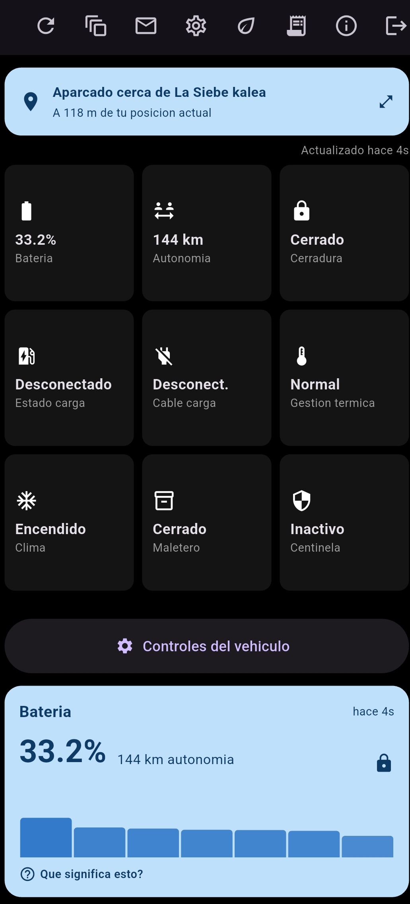</td>
    <td width="33%">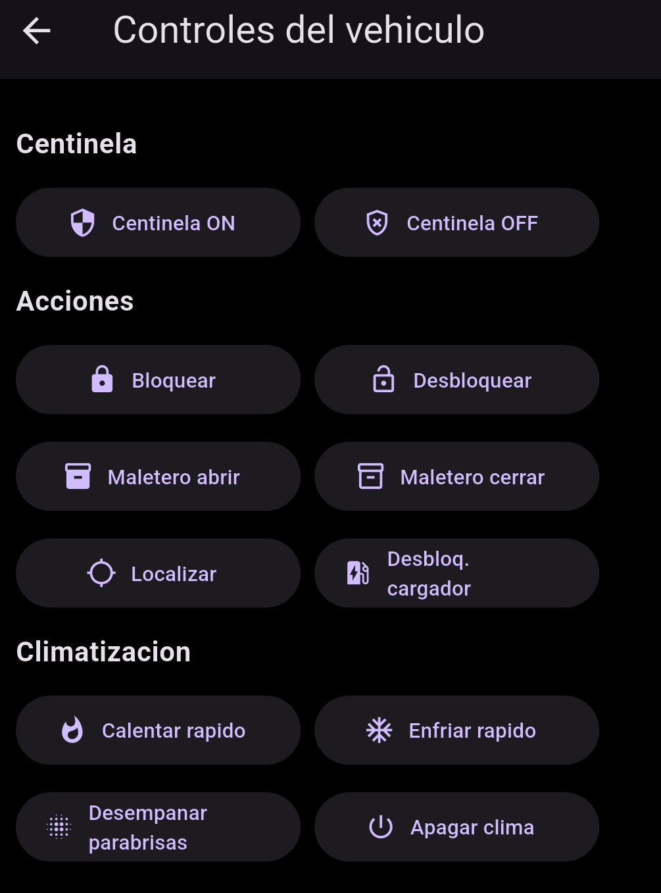</td>
    <td width="33%">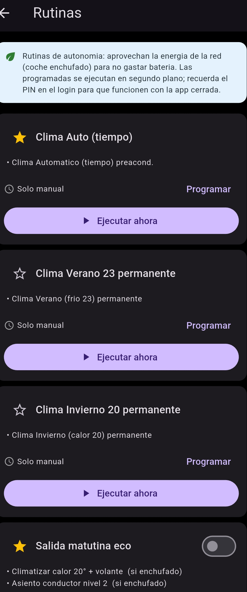</td>
  </tr>
  <tr>
    <td align="center">Panel principal · Dashboard</td>
    <td align="center">Controles remotos · Remote controls</td>
    <td align="center">Rutinas · Routines</td>
  </tr>
</table>

**Android Auto** (temporarily unavailable, see "Known limitations" / temporalmente no disponible, ver "Limitaciones conocidas") — battery with charge arc, consumption, quick actions and charger finder.

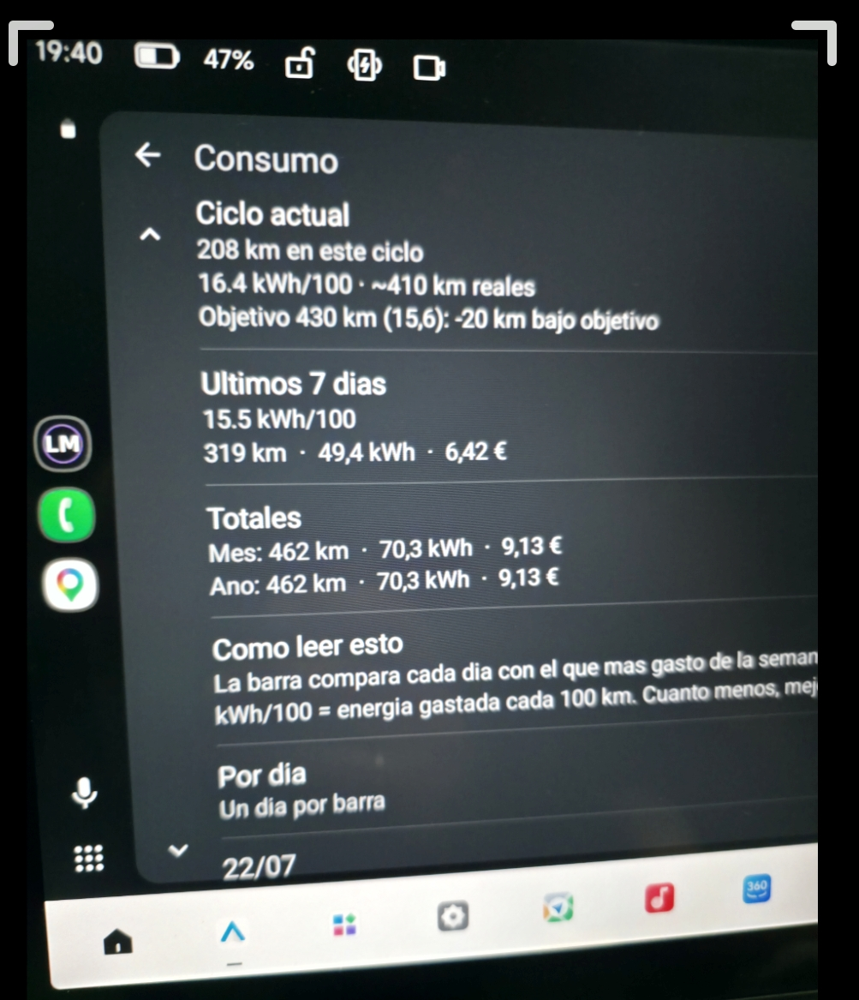

**Widget de escritorio / Home-screen widget** — consumo diario, coste y totales.

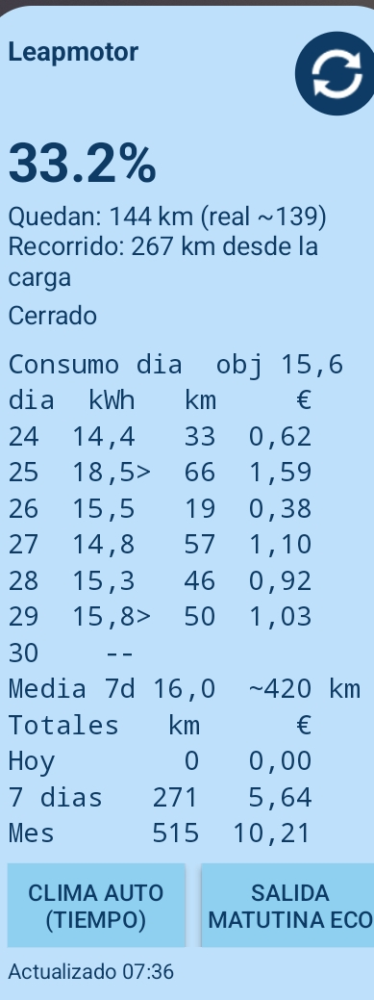

<b>Mas capturas / More screenshots</b>

<table>
  <tr>
    <td width="33%">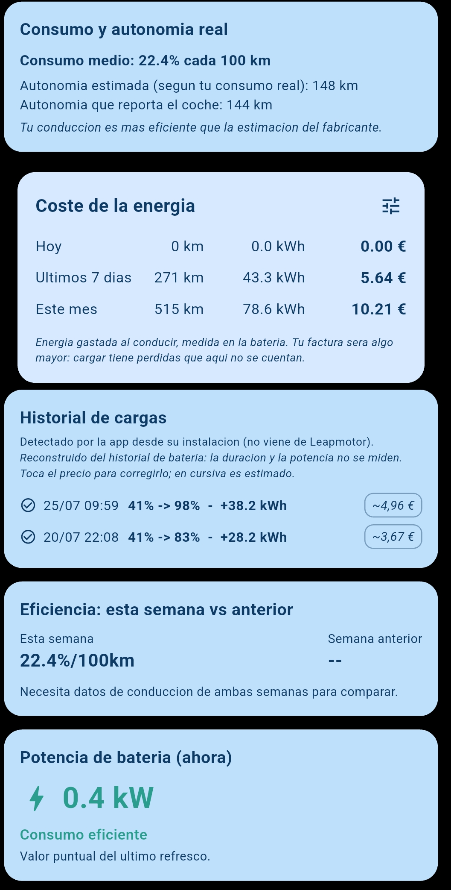</td>
    <td width="33%">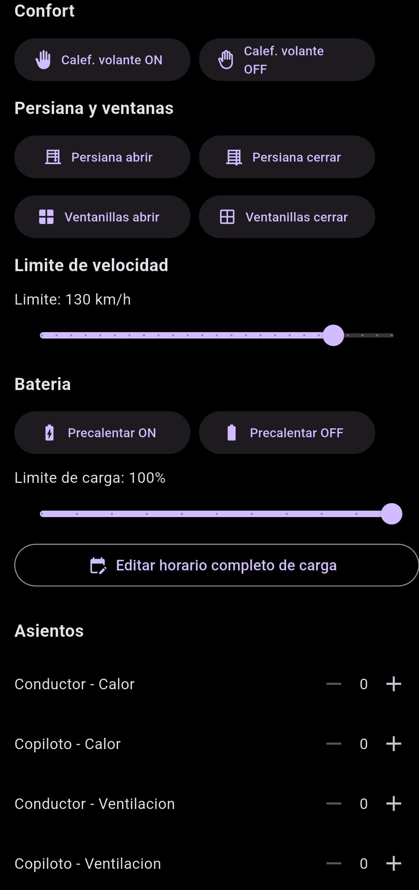</td>
    <td width="33%">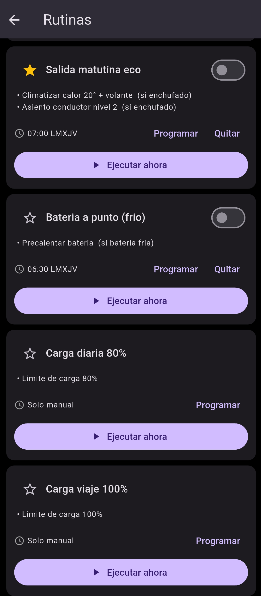</td>
  </tr>
  <tr>
    <td align="center">Consumo, cargas y coste</td>
    <td align="center">Climatizacion y asientos</td>
    <td align="center">Editor de rutinas</td>
  </tr>
  <tr>
    <td width="33%">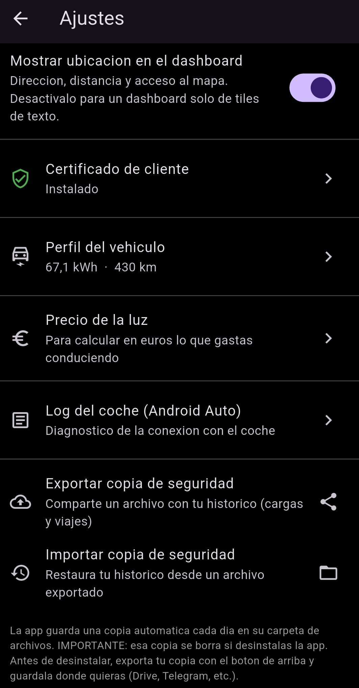</td>
    <td width="33%">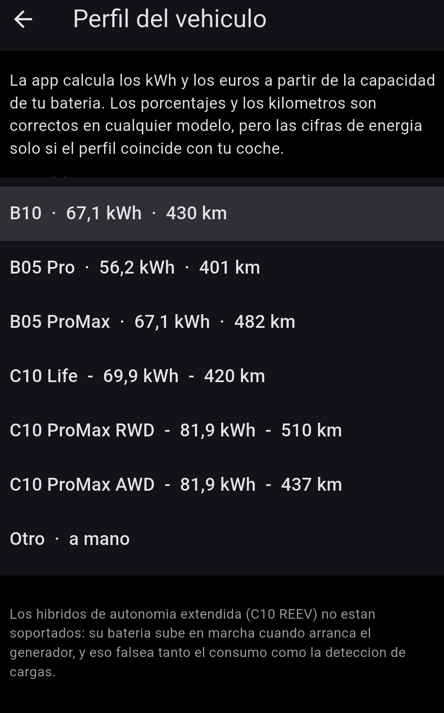</td>
    <td width="33%">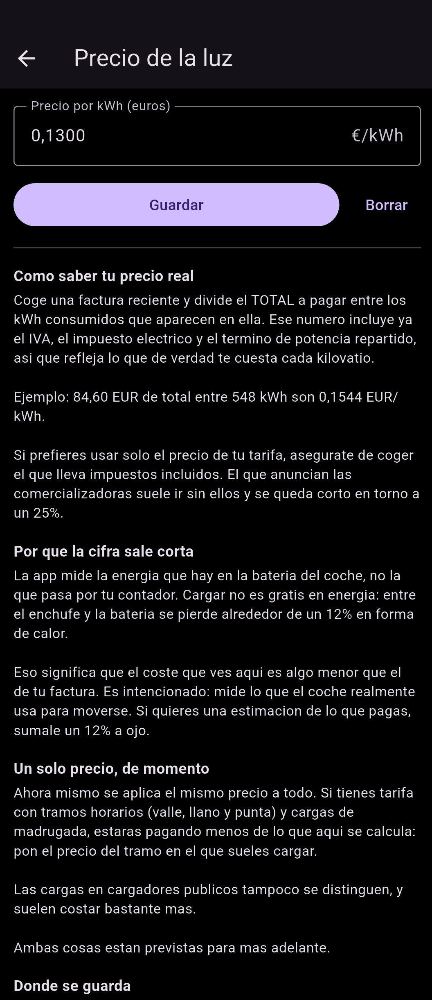</td>
  </tr>
  <tr>
    <td align="center">Ajustes · Settings</td>
    <td align="center">Ajustes · Settings</td>
    <td align="center">Ajustes · Settings</td>
  </tr>
  <tr>
    <td width="33%">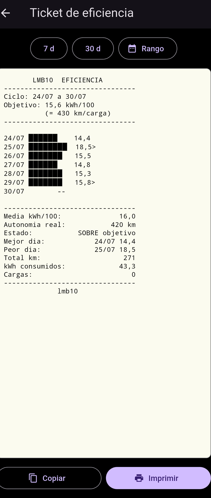</td>
    <td width="33%"></td>
    <td width="33%"></td>
  </tr>
  <tr>
    <td align="center">Ticket para impresora termica Thermal printer receipt</td>
    <td></td>
    <td></td>
  </tr>
</table>

## Author / Autor

SurferRule

## License / Licencia

GNU General Public License v3.0 (GPLv3). See the LICENSE file in this repository for the full text.
Ver el archivo LICENSE en este repositorio para el texto completo.

## Installation / Instalacion

There are two distribution channels, and **they are not interchangeable**.

Hay dos vias de distribucion, y **no son intercambiables**.

### Google Play (closed testing) / Google Play (prueba cerrada)

The official distribution channel — see "Become a tester" above for how to sign up. It's also the only channel Android Auto can use once that feature is re-enabled (see "Known limitations" for its current status).

El canal de distribucion oficial — ver "Conviertete en betatester" mas arriba para darte de alta. Es tambien el unico canal compatible con Android Auto en cuanto esa funcion se reactive (ver "Limitaciones conocidas" para su estado actual).

### GitHub Releases (APK)

Direct APK download. Installs anywhere, but **will not appear in Android Auto** even when that feature is active, since template apps only show up on the car's head unit when installed from Google Play.

Descarga directa del APK. Se instala en cualquier sitio, pero **no aparecera en Android Auto** ni siquiera cuando esa funcion este activa, ya que las apps de plantilla solo aparecen en la pantalla del coche si se instalan desde Google Play.

### Switching channels destroys your data / Cambiar de via borra tus datos

The GitHub APK and the Play build are signed with different keys, so one cannot be installed over the other. You must uninstall first — and uninstalling deletes your local trip history and your stored client certificate.

Mandatory procedure:

1. Settings → **Export backup**, and save it outside the app (share it to Drive, email, wherever).
2. Have your client certificate at hand — you will have to import it again.
3. Uninstall the old version.
4. Install from the new channel and import the backup.

Import is idempotent, so step 4 can be repeated without creating duplicates.

Los APK de GitHub y los de Play van firmados con claves distintas, asi que no se pueden instalar uno sobre otro. Hay que desinstalar primero — y desinstalar borra el historico local de viajes y el certificado de cliente guardado.

Procedimiento obligatorio:

1. Ajustes → **Exportar copia de seguridad**, y guardarla **fuera** de la app (compartirla a Drive, correo, donde sea).
2. Tener localizado el certificado de cliente: habra que volver a importarlo.
3. Desinstalar la version antigua.
4. Instalar desde la via nueva e importar la copia.

La importacion es idempotente, asi que el paso 4 se puede repetir sin duplicar nada.

## Which Leapmotor models does this work with? / Con que modelos de Leapmotor funciona

The protocol layer talks to Leapmotor's shared international backend (appgateway.leapmotor-international.de), not to model-specific endpoints. The vehicle list, login, signing, and remote-control flow are generic across Leapmotor's line-up; the only per-model detail handled explicitly is the vehicle status path (B10 and B11 share the C10 status endpoint, per the community reference client).

Development and testing has been done on a B10. Owners of other models (C10, C16, T03, B05, etc.) are welcome to try it and report back — some remote actions may not apply to every model or trim.

Since every kWh and euro figure derives from battery capacity, the app has a **vehicle profile** (Settings → Vehicle profile) where you pick your model, or type capacity and range by hand:

| Profile | Battery | WLTP range |
|---|---|---|
| B10 | 67.1 kWh | 430 km |
| B05 Pro | 56.2 kWh | 401 km |
| B05 ProMax | 67.1 kWh | 482 km |
| C10 Life | 69.9 kWh | 420 km |
| C10 ProMax RWD | 81.9 kWh | 510 km |
| C10 ProMax AWD | 81.9 kWh | 437 km |
| Other | manual | manual |

Two traps worth knowing: **the same model name can ship two different batteries** (B05 Pro vs ProMax), and **the same battery can come with very different ranges** (C10 ProMax is 510 km in RWD but 437 km in AWD). That's why capacity and range are separate fields. If your car reports a full-charge range far from the selected profile, the app warns you — it usually means the wrong variant was picked.

**Range-extender hybrids (C10 REEV) are not supported.** Their battery is recharged by the petrol generator while driving, which the app would read as a charging session, corrupting both the consumption calculation and the charge history.

La capa de protocolo habla con el backend internacional compartido de Leapmotor (appgateway.leapmotor-international.de), no con endpoints exclusivos de un modelo. El listado de vehiculos, el login, la firma de peticiones y el flujo de comandos remotos son genericos en toda la gama; el unico detalle especifico por modelo que se gestiona explicitamente es la ruta de estado del vehiculo (B10 y B11 comparten el endpoint de estado del C10, segun el cliente de referencia de la comunidad).

El desarrollo y las pruebas se han hecho sobre un B10. Si tienes otro modelo (C10, C16, T03, B05, etc.) eres bienvenido a probarlo y contarnos que tal — es posible que algunas acciones remotas no apliquen a todos los modelos o acabados.

Como todos los kWh y euros salen de la capacidad de la bateria, la app tiene un **perfil de vehiculo** (Ajustes → Perfil del vehiculo) donde eliges tu modelo, o metes capacidad y autonomia a mano. Ver la tabla de arriba.

Dos trampas que conviene conocer: **un mismo nombre de modelo puede llevar dos baterias distintas** (B05 Pro y ProMax), y **una misma bateria puede venir con autonomias muy distintas** (el C10 ProMax da 510 km en traccion trasera y 437 en total). Por eso capacidad y autonomia son campos separados. Si tu coche declara una autonomia a plena carga muy distinta a la del perfil elegido, la app te avisa: normalmente significa que se ha escogido la variante equivocada.

**Los hibridos de autonomia extendida (C10 REEV) no estan soportados.** Su bateria se recarga con el generador de gasolina en marcha, y la app leeria eso como una sesion de carga, falseando tanto el calculo de consumo como el historial.

## Features / Caracteristicas

### Session & security / Sesion y seguridad
- Real login against Leapmotor's cloud with HMAC-SHA256 request signing and mTLS (client certificate supplied by you + a per-account PKCS#12 certificate extracted at login), matching the official app's protocol.
- Persistent session: after the first login, session data is stored encrypted (flutter_secure_storage) and the access token refreshes automatically — no need to log in again unless the session fully expires.
- Optional PIN: can be remembered encrypted on-device, or requested just-in-time before opening vehicle controls.

- Login real contra la nube de Leapmotor con firma HMAC-SHA256 y mTLS (certificado de cliente aportado por ti + certificado PKCS#12 de cuenta extraido en el login), igual que el protocolo de la app oficial.
- Sesion persistente: tras el primer login, los datos de sesion se guardan cifrados (flutter_secure_storage) y el token de acceso se refresca solo, sin volver a pedir usuario/contrasena salvo expiracion total.
- PIN opcional: puede recordarse cifrado en el dispositivo, o pedirse justo antes de abrir los controles del vehiculo.

### Dashboard
- Live status with automatic refresh every 90 seconds: battery (precise SOC), range, lock, charge state and cable, battery thermal management, climate, trunk and sentry status.
- "Vehicle controls" button pinned at the top, above the battery card, for one-tap access to all remote actions.
- Compact location card: reverse-geocoded address (cached to respect OpenStreetMap/Nominatim's usage policy), distance from your current position to the car, and a tap-to-expand full-screen interactive map. Can be hidden entirely from Settings for a text-only dashboard.
- Battery card with a bar-chart history (locally recorded, fills in over time).
- Charging history card: charge sessions are **rebuilt from the stored trip history** by detecting SOC increases between consecutive samples. Leapmotor's API does not expose this history, and live detection is unreliable because the TCU sleeps overnight — so the history is reconstructed rather than polled. Duration and power are deliberately not shown: two samples can be 20 hours apart for a 4-hour charge.
- Consumption & real range card: calculates % battery used per 100 km from the odometer and compares your real-world range against the manufacturer's estimate.
- Weekly efficiency card: this week's consumption vs. last week's.
- Tire pressure card (in bar), read from the vehicle's status signals.
- Toolbar: an envelope icon with an unread-message badge, and a settings menu grouping Settings, Export history, Import backup, Guard Mode (experimental) and the Debug screen.
- Non-blocking network error handling: transient failures (tunnels, dead zones) keep the last known state visible and retry quietly instead of blanking the screen.
- Debug screen with snapshot/diff: save a full raw status snapshot, run a command, and compare exactly which fields (including unmapped raw signals) actually changed — the tool used to verify which remote commands genuinely do something on the vehicle.

- Estado en vivo con refresco automatico cada 90 segundos: bateria (SOC preciso), autonomia, cerradura, estado y cable de carga, gestion termica de la bateria, clima, maletero y centinela.
- Boton "Controles del vehiculo" fijado arriba, encima de la tarjeta de bateria, para acceder a todas las acciones remotas con un toque.
- Tarjeta de ubicacion compacta: direccion por geocodificacion inversa (cacheada para respetar la politica de uso de OpenStreetMap/Nominatim), distancia desde tu posicion actual hasta el coche, y mapa interactivo a pantalla completa al tocarla. Se puede ocultar del todo desde Ajustes para un dashboard solo de texto.
- Tarjeta de bateria con historial en barras (grabado localmente, se va rellenando con el uso).
- Tarjeta de historial de cargas: las sesiones se **reconstruyen a partir del historico de viajes guardado**, detectando subidas de SOC entre muestras consecutivas. La API de Leapmotor no expone este historico, y la deteccion en vivo no es fiable porque el TCU duerme de madrugada — por eso se reconstruye en vez de sondear. La duracion y la potencia no se muestran a proposito: entre dos muestras pueden pasar 20 horas para una carga de 4.
- Tarjeta de consumo y autonomia real: calcula el % de bateria consumido cada 100 km a partir del odometro y compara tu autonomia real con la estimacion del fabricante.
- Tarjeta de eficiencia semanal: consumo de esta semana frente a la anterior.
- Tarjeta de presion de neumaticos (en bar), leida de las senales de estado del vehiculo.
- Barra de herramientas: un icono de sobre con globo de mensajes sin leer, y un menu de ajustes que agrupa Ajustes, Exportar historico, Importar backup, Modo Vigilancia (experimental) y la pantalla de Debug.
- Manejo de errores de red no bloqueante: los fallos transitorios (tuneles, zonas sin cobertura) mantienen visible el ultimo estado conocido y reintentan en silencio en vez de dejar la pantalla en blanco.
- Pantalla de debug con snapshot/diff: guarda un estado crudo completo, ejecuta un comando, y compara exactamente que campos (incluidas senales sin mapear) cambiaron de verdad — la herramienta usada para verificar que comandos remotos hacen algo real en el vehiculo.

### Remote controls / Controles remotos
Full PIN-verification flow (AES-128-CBC encrypted operatePassword, server-side verification, and result polling), matching the real protocol:
- Lock/unlock, trunk, find vehicle, unlock charging connector.
- Quick climate (heat/cold), windshield defrost, turn off climate.
- Steering wheel and seat heating (0-3 levels), seat ventilation.
- Battery preheating, configurable charge limit, and a full charge schedule editor (time window + weekdays).
- Sunshade and windows.
- Configurable speed limit.
- Sentry mode toggle (see Known Limitations below).

Flujo completo de verificacion de PIN (operatePassword cifrado AES-128-CBC, verificacion en servidor y sondeo de resultado), replicando el protocolo real:
- Bloqueo/desbloqueo, maletero, localizar, desbloqueo del conector de carga.
- Climatizacion rapida (calor/frio), desempanado de parabrisas, apagar clima.
- Calefaccion de volante y de asientos (niveles 0-3), ventilacion de asientos.
- Precalentado de bateria, limite de carga configurable, y editor completo de horario de carga (franja horaria + dias de la semana).
- Persiana y ventanillas.
- Limite de velocidad configurable.
- Interruptor de modo centinela (ver Limitaciones conocidas mas abajo).

### Android Auto

*(Currently unavailable in the published release — see "Known limitations" and "What's new". The description below reflects the feature as it exists in the codebase.)*

*(No disponible actualmente en la version publicada — ver "Limitaciones conocidas" y "Novedades". La descripcion de abajo refleja la funcion tal como existe en el codigo.)*

A car-screen interface built on androidx.car.app templates, available when the app is installed from Google Play:

- Hub screen with Battery, Tires, Routines, Quick actions, Consumption and Chargers.
- **Battery**: charge arc, live charging power, voltage and current, cabin and battery temperature, remaining charge time.
- **Consumption**: current cycle, last 7 days (kWh/100 km, km, kWh and cost), month and year totals, and a per-day breakdown. Battery temperature is preserved with its age when the TCU is asleep, instead of showing a blank.
- **Quick actions**: twelve remote commands. The ones that physically open the car (unlock, trunk) go through a confirmation screen first.
- **Chargers**: nearby charging points from OpenStreetMap, with a detail screen that opens the route in Google Maps on the car's own screen, without needing to unlock the phone.

Charts inside the templates are rendered as text block bars; the battery arc is a generated bitmap.

Interfaz para la pantalla del coche construida sobre las plantillas de androidx.car.app, disponible cuando la app se instala desde Google Play:

- Pantalla principal con Bateria, Ruedas, Rutinas, Acciones rapidas, Consumo y Cargadores.
- **Consumo**: ciclo actual, ultimos 7 dias (kWh/100 km, km, kWh y coste), totales de mes y ano, y desglose por dia. La temperatura de bateria se conserva con su antiguedad cuando el TCU esta dormido, en vez de mostrarse en blanco.
- **Acciones rapidas**: doce comandos remotos. Los que abren fisicamente el coche (desbloqueo, maletero) pasan antes por una pantalla de confirmacion.
- **Cargadores**: puntos de recarga cercanos desde OpenStreetMap, con una pantalla de detalle que pasa la ruta a Google Maps.

Las plantillas de Android Auto no admiten graficos de ningun tipo, asi que los graficos se dibujan con barras de bloque en texto.

### Energy cost / Coste de la energia

- Configurable electricity price, stored as a structure rather than a bare number so that time-of-use bands can be added later without migrating data.
- Per-charge cost: total paid, or price per kWh, or the house price as an estimate. Estimated values are shown in italics with a `~` prefix.
- Each day inherits the price of the most recent charge before it, so changing tariff or charging away from home does not retroactively rewrite your history.
- Costs appear on the dashboard, in the home-screen widget and in Android Auto.

Note: the figures measure energy **in the battery**, with no charging-loss factor applied, so they land roughly 12–15% below what your electricity bill will say. The app states this in its own interface.

- Precio de la electricidad configurable, guardado como estructura y no como numero suelto, para poder anadir tramos horarios mas adelante sin migrar datos.
- Coste por carga: total pagado, o precio por kWh, o el precio de casa como estimacion. Los valores estimados se muestran en cursiva y con `~` delante.
- Cada dia hereda el precio de la carga anterior mas reciente, asi que cambiar de tarifa o cargar fuera de casa no reescribe el historico hacia atras.
- Los costes aparecen en el dashboard, en el widget de escritorio y en Android Auto.

Nota: las cifras miden energia **en bateria**, sin aplicar factor de perdidas de carga, asi que salen alrededor de un 12–15 % por debajo de lo que dira tu factura. La app lo advierte en su propia interfaz.

### Preconditioning / Precondicionado
- Immediate preconditioning (climate on right now) and scheduled preconditioning (recurring by weekday, or one-time), with heat/cold, target temperature, and optional steering wheel heating.

- Precondicionado inmediato (climatizar ahora mismo) y programado (recurrente por dia de la semana, o de una sola vez), con calor/frio, temperatura objetivo y calefaccion de volante opcional.

### Sentry Mode / Modo Centinela
- One-tap arming that watches the vehicle and raises high-priority notifications on tamper: uncommanded unlock, door/trunk/window opening, unexpected power-up (READY), and GPS movement/tow (Haversine drift from the parked position), with a timestamped, location-tagged event log.
- Arms the car's own on-board sentry (cmd 220) as a best-effort layer, plus optional horn+lights deterrent (cmd 120) and auto re-lock (cmd 110).
- Background watch through WorkManager; remember the PIN at login for background commands. See Known Limitations for the European firmware and TCU-sleep caveats.

- Armado en un toque que vigila el vehiculo y lanza notificaciones criticas ante manipulacion: desbloqueo no solicitado, apertura de puerta/maletero/ventanilla, encendido inesperado (READY) y movimiento/remolcado por GPS (deriva Haversine desde el punto de aparcamiento), con registro de eventos con hora y ubicacion.
- Arma el centinela propio del coche (cmd 220) como capa de mejor esfuerzo, mas disuasion opcional con claxon+luces (cmd 120) y rebloqueo automatico (cmd 110).
- Vigilancia en segundo plano mediante WorkManager; recuerda el PIN en el login para los comandos en fondo. Ver Limitaciones conocidas para el firmware europeo y el sueno del TCU.

### Experimental / Guard Mode / Experimental / Modo Vigilancia
- A guided screen for a community-documented workaround (continuous 360-camera recording with the car locked), automating the steps that do have a real API command (window, lock) and checklisting the ones that don't (ambient lights, mirrors, headlights, screens).
- Experimental buttons for two undocumented commands found in the reference protocol: a possible "camping mode" (cmd 410) and a possible dashcam-recorder toggle (cmd 290) — neither is confirmed to do anything; test them with the debug snapshot/diff tool.

- Pantalla guiada para un metodo alternativo documentado por la comunidad (grabacion continua con camaras 360 y el coche cerrado), automatizando los pasos que si tienen comando real de API (ventanilla, bloqueo) y dejando como checklist los que no (luces ambientales, espejos, faros, pantallas).
- Botones experimentales para dos comandos sin documentar del protocolo de referencia: un posible "modo acampada" (cmd 410) y un posible interruptor de la grabadora dashcam (cmd 290) — ninguno de los dos esta confirmado; pruebalos con la herramienta de snapshot/diff de debug.

### Desktop widget / Widget de escritorio
- A real, freely resizable Android home-screen widget: current SOC, manufacturer range vs. your real-world estimate, lock status, live charging indicator, daily consumption in kWh/100 km with kilometres and cost per day, and running totals for today, the last 7 days and the month.
- Adapts to the size you drag it to (compact / medium / full). Refreshes when the app is opened and periodically in the background (WorkManager, ~15 min, Android's minimum) — reliability depends on your phone manufacturer's battery management.
- RemoteViews cannot draw a Canvas, so the chart is rendered as monospaced text rather than a bitmap.

- Widget real de pantalla de inicio Android, redimensionable libremente: SOC actual, autonomia del fabricante frente a tu estimacion real, estado de cerradura, indicador de carga en vivo, consumo diario en kWh/100 km con kilometros y coste por dia, y totales acumulados de hoy, los ultimos 7 dias y el mes.
- Se adapta al tamano al que lo estires (compacto / medio / completo). Se refresca al abrir la app y periodicamente en segundo plano (WorkManager, ~15 min, el minimo de Android) — la fiabilidad depende de la gestion de bateria de tu fabricante de telefono.
- RemoteViews no admite Canvas, asi que el grafico se dibuja con texto monoespaciado en vez de con un bitmap.

### Notifications / Notificaciones
Triggered both in the foreground and during background refresh:
- Low battery (with hysteresis to avoid repeat alerts).
- Charge completed.
- Unexpected unlock (ignores actions triggered from this same app).
- Car left unlocked and parked for more than 15 minutes.
- Sentry Mode tamper alerts (when armed).

Disparadas tanto en primer plano como en el refresco de fondo:
- Bateria baja (con histeresis para no repetir avisos).
- Carga completada.
- Desbloqueo inesperado (ignora las acciones hechas desde la propia app).
- Coche desbloqueado y aparcado durante mas de 15 minutos.
- Alertas de manipulacion del Modo Centinela (cuando esta armado).

### Thermal printer receipts / Tickets en impresora termica

A niche one, born out of curiosity: the app can lay out your consumption and charging listings as a receipt and send them to a thermal printer, the same kind used for shop tickets. Handy for keeping a paper record of a trip or of a month's charging, or just for the novelty of watching your car's data come out of a till roll.

Una funcion de nicho, nacida de la curiosidad: la app puede maquetar tus listados de consumo y cargas como un ticket y mandarlos a una impresora termica, de las de tickets de comercio. Util para tener registro en papel de un viaje o de las cargas de un mes, o simplemente por el gusto de ver los datos del coche saliendo de un rollo de papel.

### Other / Otros
- Messages screen: shows the official app's message inbox, reachable from an envelope icon with an unread badge in the toolbar.
- History backup: export your trip points and charging sessions as a JSON backup plus CSV files (trips and charges), plus the raw permanent log files, via the Android share sheet, and import them back to restore the data on a new install. Import is idempotent — re-importing the same backup adds nothing. A permanent, uncapped local archive keeps the full history beyond the in-app cards.
- Settings screen: location card visibility, electricity price, certificate import.
- Bilingual: Spanish and English, following the OS language (flutter_localizations + intl).
- Custom "LM" app icon — does not reproduce Leapmotor's real logo.

- Pantalla de mensajes: muestra la bandeja de mensajes de la app oficial, accesible desde un icono de sobre con globo de no leidos en la barra de herramientas.
- Copia de seguridad del historico: exporta tus puntos de viaje y sesiones de carga como backup JSON mas ficheros CSV (viajes y cargas), mas los ficheros permanentes en crudo, por la hoja de compartir de Android, e importalos de vuelta para restaurar los datos en una instalacion nueva. La importacion es idempotente: reimportar el mismo backup no anade nada. Un archivo local permanente y sin limite conserva el historico completo mas alla de las tarjetas de la app.
- Pantalla de ajustes: visibilidad de la tarjeta de ubicacion, precio de la electricidad, importacion del certificado.
- Bilingue: espanol e ingles, siguiendo el idioma del sistema (flutter_localizations + intl).
- Icono de app propio ("LM") — no reproduce el logotipo real de Leapmotor.

## Known limitations / Limitaciones conocidas

- **Android Auto is temporarily removed** from the published release while a Google Play policy compliance review is resolved (see "What's new"). The Android Auto documentation elsewhere in this README describes the feature as it exists in the codebase, and it will return once re-approved.
- Sentry mode (cmd 220) is accepted and confirmed by the server, but testing showed no observable change in the vehicle's reported state (not even in unmapped raw signals). Everything points to it not being actually implemented on this vehicle's firmware/hardware, even though the command exists in the protocol. Sentry Mode therefore relies mainly on its app-side watchdog layer.
- Parked camera recording is disabled in the current UK/EU firmware; the on-board dashcam only records while driving (3-minute blocks to a USB stick in the "REC" port).
- The TCU enters deep sleep about 13 minutes after locking, so cloud-based watching pauses until the car wakes back up (e.g. a door opening wakes it and the next poll catches the change) — it's not equivalent to a real-time server push. This is also why overnight charging cannot be watched live and has to be reconstructed afterwards.
- Energy figures assume a fixed 67.1 kWh battery — see the model section above.
- Reading messages in this app does not mark them as read on Leapmotor's server (no such endpoint is documented), so the unread badge is tracked locally and resets when you open the inbox.
- The "camping mode" (ON3, cmd 410) and dashcam-recorder toggle (cmd 290) commands are unconfirmed experiments — test with the debug tool before relying on them.
- Live 360-camera streaming is not possible: car templates have no video surface, the 360 view is generated by the car's own hardware and never reaches the cloud, and showing video to the driver would breach distraction rules.
- Background refresh depends on Android's WorkManager and is subject to each manufacturer's battery-saving restrictions (Xiaomi/MIUI, Samsung, etc. are notably aggressive). It's not equivalent to a real server push notification.
- Locally-inferred history (charging sessions, consumption, efficiency) has no retroactive data before installing that feature, and may miss sessions if the app was closed for a long time.
- Guard Mode leaves a window ajar during part of its sequence, reducing the car's physical security while it lasts — occasional, conscious use only.
- The full charge/preconditioning schedule format (time windows, weekday encoding) is inferred by symmetry with the reference source code, not 100% confirmed from a live capture — verify by feeling whether the car actually behaves as scheduled.

- **Android Auto esta retirado temporalmente** de la version publicada mientras se resuelve una revision de cumplimiento de politicas de Google Play (ver "Novedades"). La documentacion de Android Auto del resto de este README describe la funcion tal como existe en el codigo, y volvera en cuanto se reapruebe.
- El modo centinela (cmd 220) es aceptado y confirmado por el servidor, pero las pruebas no mostraron ningun cambio observable en el estado reportado del vehiculo (ni en senales crudas sin mapear). Todo apunta a que no esta realmente implementado en el firmware/hardware de este vehiculo, aunque el comando exista en el protocolo. Por eso el Modo Centinela se apoya sobre todo en su capa de vigilancia en la app.
- La grabacion con camaras estando aparcado esta desactivada en el firmware UK/UE actual; el dashcam de a bordo solo graba en marcha (bloques de 3 minutos a un USB en el puerto "REC").
- El TCU entra en sueno profundo unos 13 minutos tras bloquear, asi que la vigilancia basada en la nube se pausa hasta que el coche despierta (p. ej. abrir una puerta lo despierta y el siguiente sondeo detecta el cambio) — no equivale a un push en tiempo real del servidor. Es tambien la razon por la que la carga nocturna no se puede vigilar en vivo y hay que reconstruirla despues.
- Las cifras de energia asumen una bateria fija de 67,1 kWh — ver la seccion de modelos mas arriba.
- Leer los mensajes en esta app no los marca como leidos en el servidor de Leapmotor (no hay endpoint documentado para ello), asi que el globo de no leidos se lleva localmente y se pone a cero al abrir la bandeja.
- Los comandos de "modo acampada" (ON3, cmd 410) y de interruptor de grabadora dashcam (cmd 290) son experimentos sin confirmar — pruebalos con la herramienta de debug antes de confiar en ellos.
- Ver las camaras 360 en directo no es posible: las plantillas del coche no admiten superficie de video, la vista 360 la genera el hardware del propio coche y nunca pasa por la nube, y mostrar video al conductor incumpliria las normas de distraccion.
- El refresco en segundo plano depende de WorkManager de Android y esta sujeto a las restricciones de ahorro de bateria de cada fabricante (Xiaomi/MIUI, Samsung, etc. son especialmente agresivos). No equivale a una notificacion push real del servidor.
- El historial inferido localmente (sesiones de carga, consumo, eficiencia) no tiene datos retroactivos anteriores a instalar esa funcion, y puede perder sesiones si la app estuvo mucho tiempo cerrada.
- El Modo Vigilancia deja una ventanilla entreabierta durante parte de su secuencia, reduciendo la seguridad fisica del coche mientras dura — uso puntual y consciente unicamente.
- El formato completo del horario de carga/precondicionado (franjas horarias, codificacion de dias) se infiere por simetria con el codigo fuente de referencia, no esta 100% confirmado con una captura real — verificalo sintiendo si el coche se comporta realmente segun lo programado.

## Certificates / Certificados

Connecting to Leapmotor's servers requires a client certificate for mTLS. **This repository does not contain it and this app does not distribute it.** The certificate is Leapmotor's material and redistributing it is not an option.

Each user must obtain their own and import it from within the app: **Settings → Import certificate**. The certificate is then stored encrypted on the device (flutter_secure_storage) and never leaves it. Community sources such as markoceri/leapmotor-certs document how this material is obtained.

The per-account PKCS#12 certificate is a different thing: it is extracted automatically during login and requires no action from you.

Conectarse a los servidores de Leapmotor requiere un certificado de cliente para mTLS. **Este repositorio no lo contiene y esta app no lo distribuye.** El certificado es material de Leapmotor y redistribuirlo no es una opcion.

Cada usuario debe conseguir el suyo e importarlo desde la propia app: **Ajustes → Importar certificado**. El certificado queda guardado cifrado en el dispositivo (flutter_secure_storage) y no sale de el. Fuentes comunitarias como markoceri/leapmotor-certs documentan como se obtiene este material.

El certificado PKCS#12 de cuenta es otra cosa distinta: se extrae automaticamente durante el login y no requiere ninguna accion por tu parte.

## Tech stack / Stack tecnico

- Flutter (Android), with native Kotlin for the home-screen widget and the Android Auto screens
- http and dart:io SecurityContext for mTLS
- crypto (SHA-256, HMAC, MD5) and pointycastle (AES-128-CBC) for Leapmotor's signing/encryption protocol
- androidx.car.app for the Android Auto templates
- flutter_map + latlong2 for the map; geolocator for distance calculation
- Overpass API / OpenStreetMap for the charger map; Nominatim for reverse geocoding
- flutter_secure_storage for session, PIN, client certificate and local history
- home_widget for the home-screen widget; workmanager for background refresh
- flutter_local_notifications for alerts (requires core library desugaring in Gradle)
- flutter_localizations + intl for bilingual support (es/en)
- share_plus + path_provider for history export; file_selector for backup import

Mismo stack en espanol: Flutter (Android) con Kotlin nativo para el widget y las pantallas de Android Auto; http y dart:io SecurityContext para mTLS; crypto y pointycastle para el protocolo de firma/cifrado; androidx.car.app para las plantillas de Android Auto; flutter_map + latlong2 para el mapa; geolocator para la distancia; Overpass/OpenStreetMap para el mapa de cargadores y Nominatim para la geocodificacion inversa; flutter_secure_storage para sesion, PIN, certificado e historial; home_widget y workmanager para el widget y el refresco de fondo; flutter_local_notifications para alertas; flutter_localizations + intl para el bilingue; share_plus + path_provider para la exportacion del historico; file_selector para importar el backup.

## Project structure / Estructura del proyecto

    lib/leapmotor_engine.dart        API client: login, HMAC signing, PKCS#12, remote commands, status parsing
    lib/main.dart                    Dashboard, cards, settings, notifications, background refresh
    lib/widget_chart.dart            Home-screen widget renderer and consumption/charge calculations
    lib/daily_stats.dart             Incremental daily aggregation engine + charge history rebuild
    lib/energy_cost.dart             Electricity price model and per-day cost totals
    lib/charge_cost.dart             Per-charge cost (total paid, price per kWh, or estimate)
    lib/price_screen.dart            Electricity price settings
    lib/vehicle_profile.dart         Battery capacity / range profile per model
    lib/vehicle_profile_screen.dart  Model selection UI
    lib/cert_store.dart              Encrypted storage for the user-supplied client certificate
    lib/cert_import_screen.dart      Certificate import flow
    lib/history_archive.dart         Permanent local history archive + backup export/import
    lib/trip_rebuild.dart            Route segmentation from the permanent trip log
    lib/route_map_screen.dart        GPS route map for a single trip
    lib/trip_list_screen.dart        "Recent trips" screen
    lib/ticket_printer.dart          Receipt layout for thermal printers
    lib/car_log_bridge.dart          File-based diagnostic log, shared with the Kotlin side
    lib/car_log_screen.dart          On-device viewer for that log
    lib/sentry/                      Sentry Mode: engine, adapter, notifier and screen
    lib/routines/                    Routines engine and screen
    lib/about_screen.dart            About screen
    lib/messages_screen.dart         Official app message inbox
    lib/guard_mode_screen.dart       Experimental Guard Mode screen
    lib/preconditioning_screen.dart  Preconditioning (immediate + scheduled)
    lib/charge_schedule_screen.dart  Full charge schedule editor
    lib/settings_screen.dart         App settings
    lib/l10n/                        Translation source files (.arb); generated code is not edited by hand
    android/.../BatteryWidgetProvider.kt   Native home-screen widget provider
    android/.../LMB10CarAppService.kt      Android Auto entry point and session (currently unregistered in the manifest, see Known limitations)
    android/.../CarMainScreen.kt           Android Auto hub
    android/.../ConsumoScreen.kt           Android Auto consumption screen
    android/.../ChargersScreen.kt          Nearby chargers
    android/.../ChargerDetailScreen.kt     Charger detail and navigation hand-off
    android/.../QuickActionsScreen.kt      Remote commands from the car screen
    android/.../CarLog.kt                  File-based diagnostic log
    android/.../BatteryScreen.kt           Android Auto battery screen with the charge arc
    web/screenshots/                 Screenshots used in this README

Note: `lib/l10n/generated/` is produced by `flutter gen-l10n` on every build (`generate: true` in pubspec.yaml). Edit the `.arb` files, never the generated Dart.

Nota: `lib/l10n/generated/` lo produce `flutter gen-l10n` en cada build (`generate: true` en pubspec.yaml). Edita los `.arb`, nunca el Dart generado.

## Protocol summary / Resumen del protocolo

This app replicates the real protocol used by Leapmotor's official international app, cross-checked against the community Python client leapmotor-api (github.com/markoceri/leapmotor-api):

1. Login, signed with SHA-256, using mTLS with the client certificate.
2. The response includes an account certificate in PKCS#12 (base64Cert), whose password is derived deterministically (MD5, then SHA-256, then SM4 encryption with fixed protocol tables) — no brute-forcing required.
3. Authenticated requests use HMAC-SHA256 signed headers (key derived via HKDF-SHA256 from the login's signIkm/signSalt/signInfo).
4. Remote commands require encrypting the vehicle PIN with AES-128-CBC (key/IV derived from the session token), verifying it first, then polling the result.
5. Vehicle status arrives as numeric signal IDs, translated to readable names.
6. The access token can be refreshed using the refreshToken, without re-entering credentials.

The app never talks directly to the vehicle: everything goes app → cloud → car. It sends no CAN or UDS frames and cannot damage the vehicle.

Esta app replica el protocolo real de la app oficial internacional de Leapmotor, verificado contra el cliente Python de la comunidad leapmotor-api (github.com/markoceri/leapmotor-api):

1. Login firmado con SHA-256, con mTLS usando el certificado de cliente.
2. La respuesta incluye un certificado de cuenta PKCS#12 (base64Cert), cuya contrasena se deriva de forma deterministica (MD5, luego SHA-256, luego cifrado SM4 con tablas fijas), sin fuerza bruta.
3. Las peticiones autenticadas usan cabeceras firmadas HMAC-SHA256 (clave derivada via HKDF-SHA256 del signIkm/signSalt/signInfo del login).
4. Los comandos remotos cifran el PIN con AES-128-CBC (clave/IV derivados del token de sesion), lo verifican primero, y sondean el resultado despues.
5. El estado del vehiculo llega con IDs de senal numericos, traducidos a nombres legibles.
6. El token de acceso se puede refrescar con el refreshToken, sin reintroducir credenciales.

La app nunca habla directamente con el vehiculo: todo va app → nube → coche. No manda tramas CAN ni UDS y no puede averiar el vehiculo.

## Building / Compilar

    flutter pub get
    flutter build apk --release

Additional requirements / Requisitos adicionales:
- Core library desugaring enabled in android/app/build.gradle.kts (needed by flutter_local_notifications).
- Signing configuration in android/key.properties (not in this repository).
- To install the desktop widget: long-press an empty space on your home screen, tap Widgets, find LMB10, and drag the widget in. You may need to remove and re-add it after some updates.
- For reliable background refresh: exclude the app from battery optimization in your phone's settings (path varies by manufacturer).
- Android Auto screens can only be tested on a real head unit through a Google Play install, or locally with the Desktop Head Unit (DHU) — and only while the manifest declares the Android Auto entry point (see Known limitations).

- Core library desugaring habilitado en android/app/build.gradle.kts (lo necesita flutter_local_notifications).
- Configuracion de firma en android/key.properties (no incluida en este repositorio).
- Para instalar el widget de escritorio: mantener pulsado un espacio vacio del escritorio, tocar Widgets, buscar LMB10, y arrastrarlo. Puede que haga falta quitarlo y volver a anadirlo tras alguna actualizacion.
- Para un refresco de fondo fiable: excluye la app de la optimizacion de bateria en los ajustes de tu telefono (la ruta varia segun el fabricante).
- Las pantallas de Android Auto solo se pueden probar en un head unit real instalando desde Google Play, o en local con el Desktop Head Unit (DHU) — y solo mientras el manifest declare el punto de entrada de Android Auto (ver Limitaciones conocidas).

## Support the project / Apoyar el proyecto

LMB10 is free, open source, and has no ads or trackers. If it's useful to you and you feel like buying me a coffee, it's very welcome — and entirely optional.

LMB10 es gratis, de codigo abierto, y no tiene publicidad ni rastreadores. Si te resulta util y te apetece invitarme a un cafe, se agradece mucho, y es completamente opcional.

### ☕ [ko-fi.com/txurtxil](https://ko-fi.com/txurtxil)

To be clear: donations don't buy priority support, feature requests or any guarantee. This is a spare-time project and it stays that way.

Que quede claro: las donaciones no compran soporte prioritario, peticiones de funciones ni ninguna garantia. Esto es un proyecto de tiempo libre y va a seguir siendolo.

## Credits / Creditos

This project would not have been possible without the community's reverse-engineering work:
Este proyecto no habria sido posible sin el trabajo de ingenieria inversa de la comunidad:

- markoceri/leapmotor-api — reference Python client for the protocol / cliente Python de referencia para el protocolo
- markoceri/leapmotor-certs — mTLS certificate material / material de certificados mTLS
- markoceri/leapconnect — reference web dashboard / dashboard web de referencia
- kerniger/leapmotor-ha — Home Assistant integration, C10/B10 signal mapping / integracion de Home Assistant, mapeo de senales C10/B10

## Legal notice / Aviso legal

Personal, experimental, non-commercial project for interoperability and research purposes. The EU Data Act requires manufacturers to provide access to vehicle data; as of this README, Leapmotor does not yet offer a documented public API to comply with it. Use this software at your own risk — there is no guarantee it will keep working if Leapmotor changes its backend.

Proyecto personal y experimental, sin animo de lucro, con fines de interoperabilidad e investigacion. El Reglamento de la UE sobre Datos (EU Data Act) obliga a los fabricantes a proporcionar acceso a los datos del vehiculo; a fecha de este README, Leapmotor aun no ofrece una API publica documentada para cumplirlo. Usa este software bajo tu propio riesgo, no hay garantia de que siga funcionando si Leapmotor modifica su backend.
